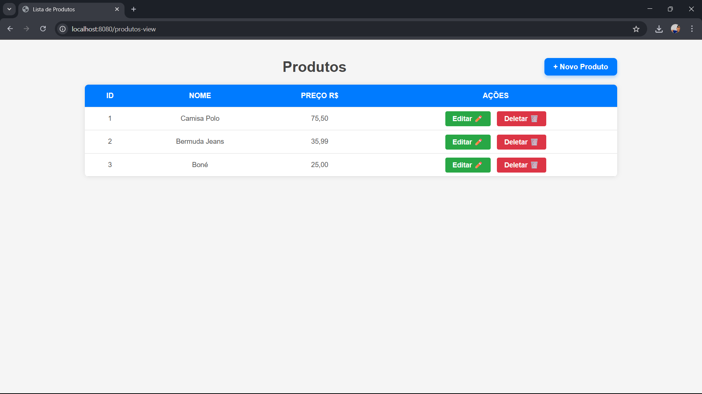

# Spring Boot CRUD

Este é um projeto simples de CRUD de produtos desenvolvido com **Spring Boot**, com o objetivo de aprendizado e prática em desenvolvimento backend com Java.

## 🌐 Demonstração



## 🚀 Tecnologias Utilizadas

- **Java 17**
- **Spring Boot**
  - Spring Web
  - Spring Data JPA
- **Thymeleaf**
- **Maven**
- **Swagger (Springdoc OpenAPI)**
- **Lombok**
- **Banco de dados** (integração pendente)

## 🔧 Funcionalidades

- [x] Estrutura base de um projeto Spring Boot
- [x] Configuração inicial do Swagger
- [x] CRUD básico (em desenvolvimento)

## 🛠️ Tarefas Pendentes

- [x] Implementar todos os endpoints (Create, Read, Update, Delete)
- [x] Documentar os endpoints no Swagger com descrições e exemplos
- [x] Integrar com um banco de dados (por exemplo, H2, MySQL ou PostgreSQL)
- [x] Implementar validações nos dados de entrada

## 📁 Clonando o projeto

```
git clone https://github.com/Plcc18/springboot-crud.git
cd springboot-crud
```
## ▶️ Executando
Certifique-se de ter o Java 17+ e o Maven instalados. Em seguida, execute:

```
mvn spring-boot:run
```

- Acesse a URL da página no seu navegador: `http://localhost:8080/produtos-view`
## 📄 Swagger

- Acesse a documentação da API:`http://localhost:8080/swagger-ui/index.html`

## 💾 Banco de Dados H2

- Console web do banco H2 disponível em: `http://localhost:8080/h2-console`
- JDBC URL padrão: `jdbc:h2:file:./data/springbootcruddb`
- Usuário: `sa`
- Senha: (vazia)

Desenvolvido por Plcc18 – Em constante aprendizado 🚀
